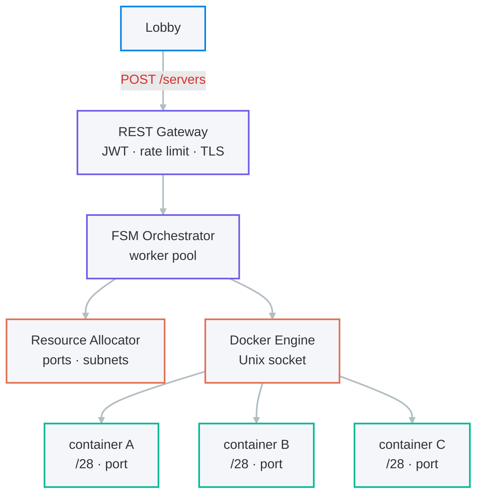

# minestrate

Isolated Minecraft minigame servers, on demand. REST API over Docker, written in Go.

## Quickstart

> [!NOTE]
> Requires Docker running on the host and Go 1.22+.

```bash
# 1. Clone and build
git clone https://github.com/mitsuakki/minestrate
cd minestrate
go build -o minestrate ./cmd/minestrate

# 2. Configure
cp config/config.example.yaml config.yaml
# edit config.yaml

# 3. Run
./minestrate --config config.yaml
```

## Why

Running a Minecraft minigame lobby means spinning up isolated game servers on player demand and tearing them down cleanly when the game ends.
Doing this by hand doesn't scale. Doing it with a full Kubernetes cluster is overkill.<br>

**minestrate** is a single Go binary that exposes a REST API over the Docker socket.

- One `POST` creates an isolated PocketMine-MP server with its own network, port, and lifecycle.
- One `DELETE` drains and removes it.

## How it works



## API

> [!IMPORTANT]
> All endpoints require a `Bearer` JWT issued by the lobby.

### Create a server

`POST /servers`

**Request:**

```http
POST /servers
Content-Type: application/json

{
  "game":    "skywars",
  "players": 8
}
```

### Get server state

`GET /servers/{id}`

```json
{
  "id": "srv_01j4k",
  "state": "running",
  "address": "10.0.0.1",
  "port": 25565,
  "players": 4,
  "created": "2024-11-01T14:22:00Z"
}
```

### Stop a server

`DELETE /servers/{id}`

Transitions the server to `draining`. Players are notified, then the container is stopped and all resources are released. Returns `202 Accepted`.

### List servers

`GET /servers`

Returns the projection of all active servers. Stopped servers are not included.

## Design Decisions

### Port allocation is a pure injection.

The allocator maintains a bitset over the configured port range and reserves ports atomically with a CAS operation. Two servers can never share a port by construction; it is an invariant enforced at the data structure level, not a runtime check.

### Server lifecycle is a finite state machine.

The five states and their transitions are the only mutations allowed on a server record. Every HTTP handler maps to exactly one transition. This makes the system straightforward to reason about: if you know the current state, you know every possible next state.

### Worker pool is sized by M/M/c queueing theory.

Given a measured mean container start time $1/\mu$ and an expected peak request rate $\lambda$, the number of workers $c$ satisfies:

```math
\rho = \frac{\lambda}{c\mu} < 0.8
```

Beyond 0.8 utilisation, queue wait times grow non-linearly. The default of 4 workers handles up to $3.2\mu$ requests per second before queueing becomes noticeable.

### Network isolation is structural.

Each container receives a dedicated `/28` subnet carved from the configured block. Subnets are disjoint by construction; game servers cannot reach each other's networks unless explicitly routed.

### Authentication is stateless.

JWT verification is $O(1)$ and requires no database round-trip. The lobby signs tokens with a shared secret; minestrate verifies the signature and checks expiry. No session store, no distributed state.

### Start timeout is derived from measured variance.

The `start_timeout` value should be set to $\mu_T + 10\sigma_T$ where $\mu_T$ is the mean container start time and $\sigma_T$ its standard deviation, measured on your hardware. This bound (from Chebyshev's inequality) keeps false timeouts below 1% under any start time distribution.

## Configuration

```yaml
# config.yaml
env: prod

server:
  port: 8080
  tls_cert: "" # Optional: path to your cert.pem
  tls_key: ""  # Optional: path to your key.pem

auth:
  jwt_secret: "your-secret"
  token_ttl: 300

docker:
  socket: "" # Default platform socket (e.g. /var/run/docker.sock or npipe:////./pipe/docker_engine)
  image: pmmp/pocketmine-mp:latest
  cpu_limit: 1.0
  memory_limit: 512m

orchestrator:
  workers: 4
  max_servers: 100
  start_timeout: 30

ports:
  range_start: 19132
  range_end: 20132

network:
  subnet_block: 172.20.0.0/14
```

## Metrics

On this hardware (**AMD Ryzen 7 4800H**, 8 Cores, 16GB RAM, Windows 11 Pro), the mean Docker container start time ($\mu$) was measured using a baseline `alpine` image:

| Metric | Value |
| :--- | :--- |
| Mean start time ($1/\mu$) | 1.18s |
| Throughput ($\mu$) | 0.85 starts/sec |

### Worker Pool Throughput

The following benchmark measures the throughput of the orchestrator worker pool with varying numbers of workers ($c$). To simulate realistic load, an artificial delay of 100ms was added to each container creation job.

| Workers ($c$) | Throughput (starts/sec) | Scaling |
| :--- | :--- | :--- |
| 1 | 9.94 | 1.0x |
| 2 | 19.89 | 2.0x |
| 4 | 38.79 | 3.9x |

These values confirm that the system scales linearly with the number of workers until it hits the host's I/O or Docker socket bottlenecks.


These values are used to tune the worker pool size and start timeout as described in the Design Decisions section.

## License

MIT
